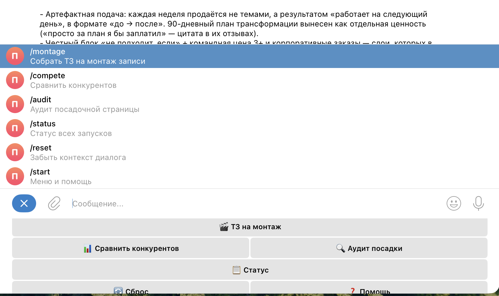

# 🎛 Пульт оркестра

Telegram-пульт и CLI для управления запусками Zerocoder поверх **оркестра субагентов**.
Сводит статус всех запусков из `_state.md` и пускает любой вопрос через оркестр
(`claude -p`) — с компьютера и с телефона.

> MVP в рамках курса по агентным системам. Полное описание — в [`docs/project-description.md`](docs/project-description.md).

## Зачем

Я веду параллельно несколько запусков — вебинары, акции, интенсивы. По каждому в
проекте лежит `_state.md` с этапами и открытыми вопросами. Две боли:

1. **Статус расползается по папкам** — нет единой картины, что на какой стадии.
2. **Оркестр из 14 субагентов живёт только в редакторе** — с телефона к нему не подойти.

Пульт закрывает обе: статус-борд одной командой + мост к оркестру в Telegram.

## Что за оркестр стоит за пультом

За пультом — оркестр субагентов на Claude Code. Собираю его, чтобы закрыть работу, которую обычно делает живой ассистент по запускам.

**Из чего собран:**
- Главный агент — принимает задачу и передаёт её нужному субагенту.
- Субагенты по жанрам: концепции, лендинги, аудит страниц, анонсы для почты и Telegram, гайды и презентации, анализ конкурентов, ТЗ на монтаж эфиров, редактура.
- База знаний — продукт, аудитория, тон в одном месте. Субагенты сверяются с ней, а не придумывают.
- Скиллы и чек-листы — чтобы каждый жанр собирался по одному стандарту.

**Что это решает:**
- Не нужно каждый раз заново объяснять контекст: продукт, аудиторию и тон система знает один раз и держит во всех задачах.
- Меньше непроверенных фактов в материалах — есть один источник правды и правило «не уверен — пометь, не выдумывай».
- Каждую задачу делает свой субагент под неё, а не один помощник на всё подряд.

**Сейчас довожу три направления, по одному:**
- 🎬 **ТЗ на монтаж эфиров** — смотрит запись, ловит косяки, устаревшие даты на экране, оговорки → собирает правки монтажёру.
- 🔍 **Анализ конкурентов** — цены, офферы, форматы. С проверкой по самим сайтам, а не по агрегаторам, и со скриншотами-пруфами.
- 🧭 **Аудит наших страниц** — где слабый оффер, что недожато, что чинить по конверсии, какие ссылки битые.

Каждое направление прохожу одинаково: прогоняю на реальной задаче, смотрю, что правлю руками, и закрепляю это правилом в субагенте. Пульт — то, через что я обращаюсь к оркестру с телефона.

## Что умеет

| Функция | CLI | Telegram |
|---------|-----|----------|
| Кнопочное меню (📋 Статус / 🔄 Сброс / ❓ Помощь) — команды набирать не нужно | — | ✅ постоянное меню снизу |
| Статус-борд по всем `_state.md` (прогресс, дата, открытые вопросы, стадия) | `python3 cli.py status` | кнопка «📋 Статус» или `/status` |
| Вопрос оркестру через `claude -p` | `python3 cli.py ask "..."` | любой текст |
| 🎬 **ТЗ на монтаж** — запись эфира → черновик ТЗ (фоном, придёт файлом) | — | кнопка «🎬 ТЗ на монтаж» или `/montage` |
| 📊 **Сравнить конкурентов** — список школ → таблица сравнения + вывод (фоном → файл) | — | кнопка «📊 Сравнить конкурентов» или `/compete` |
| 🔍 **Аудит посадки** — ссылка на лендинг → ранжированные правки (фоном → файл) | — | кнопка «🔍 Аудит посадки» или `/audit` |
| Память диалога — контекст между сообщениями (сессия на чат) | — | ✅, сброс кнопкой «🔄 Сброс» или `/reset` |
| Не висит на тяжёлых запросах: async-вызов + ack «работаю…» + живой «печатает» | — | ✅ |
| Замок доступа на один Telegram ID | — | ✅ |

Тяжёлые задачи (монтаж, конкуренты, аудит) идут **фоновым процессом**: бот сразу отвечает «считаю в фоне», не висит, а готовый файл досылает наблюдатель, когда задача досчитает (переживает перезапуск бота).

## Как это выглядит

CLI — статус-борд и вопрос оркестру (реальный вывод):


Telegram-бот — вопрос оркестру прямо в чате (реальный ответ через `claude -p`):


Меню бота — кнопки-задачи и команды (ТЗ на монтаж · сравнить конкурентов · аудит посадки · статус):



## Архитектура

```
Telegram / терминал
        │
   ┌────┴─────┐
   │  bot.py  │  cli.py        ← интерфейсы (замок на user ID в боте)
   └────┬─────┘──────┐
        │            │
  ┌─────▼─────┐ ┌────▼──────────┐
  │ tracker.py│ │ orchestra.py  │
  │ читает    │ │ claude -p     │
  │ _state.md │ │ в папке проекта
  └───────────┘ └───────┬───────┘
                        │
              оркестр субагентов
              (.claude/agents, knowledge-base, skills)
```

Прослойка тонкая: трекер — чистый парсинг файлов на стандартной библиотеке, мост —
обёртка над `subprocess`. Вся «тяжёлая» логика остаётся в уже собранном оркестре.

## Запуск

### Трекер (без зависимостей)

```bash
python3 cli.py status
```

### Вопрос оркестру (нужен установленный Claude Code)

```bash
python3 cli.py ask "Что на очереди по плану?"
```

### Telegram-бот

```bash
python3 -m venv .venv && source .venv/bin/activate
pip install -r requirements.txt
cp .env.example .env       # заполнить токен и user ID
python3 src/bot.py
```

Для `.env` нужны:
- `TELEGRAM_BOT_TOKEN` — токен от [@BotFather](https://t.me/BotFather);
- `ALLOWED_USER_ID` — твой Telegram ID от [@userinfobot](https://t.me/userinfobot).

## Скилл

В репозитории лежит скилл проекта — [`skills/launch-pult/SKILL.md`](skills/launch-pult/SKILL.md).
Он учит агента, когда дёргать пульт (статус запусков / вопрос оркестру / запуск бота)
и по какому чек-листу.

## Структура

```
launch-pult/
├── cli.py                      # команды status / ask
├── src/
│   ├── tracker.py              # парсер _state.md → статус-борд
│   ├── orchestra.py            # мост к оркестру через claude -p (синхронный ответ)
│   ├── montage_jobs.py         # фоновые задачи: ТЗ на монтаж (детерминированный скрипт)
│   ├── analysis_jobs.py        # фоновые задачи: конкуренты + аудит (claude -p пишет файл)
│   └── bot.py                  # Telegram-бот (замок на user ID)
├── mcp-analysis.json           # MCP для фоновых задач: playwright в изолированном профиле
├── jobs/                       # состояние фоновых задач (gitignored)
├── skills/launch-pult/SKILL.md # скилл проекта
├── docs/project-description.md # полное описание проекта
├── screenshots/                # скриншоты работы
├── requirements.txt
└── .env.example
```

## Безопасность

- Токен и ID — только в `.env` (в `.gitignore`, в репозиторий не попадает).
- Бот отвечает строго владельцу; чужие сообщения отклоняются с записью в лог.
- Оркестр запускается в границах рабочей папки, наружу ничего не отправляется.
- Права точечные: оркестру разрешены `Write` и `Edit` (создать/править файл по запросу),
  но не `Bash` — удаление (`rm`) недоступно. Настройка `ORCHESTRA_ALLOWED_TOOLS`,
  пусто = read-only. Проверено в бою: запись проходит, удаление блокируется.

## Дальше

### 🧭 Разведчик воронки конкурента (следующий крупный модуль)

Сейчас кнопки разбирают **статику** конкурента (лендинг, цены, оффер). Следующий шаг —
собрать **воронку целиком по оси времени**: регистрация → прогрев → офферы на эфире →
постпродажа. То, что не виден на лендинге, а разворачивается в письмах и сообщениях
после подписки.

**Принцип (MVP):** человек делает редкие ручные шаги (подписка одним реальным контактом,
скрин бота), агент синтезирует карту воронки. Не автономный «тайный покупатель» — это
хрупко и спорно по ToS. Один контакт под контролем владельца, без фабрикации личностей и
обхода капчи.

**Что строится:**
- субагент `funnel-analyst` — достраивает цепочку касаний по времени (чего нет в статике);
- методичка «Разведка воронки» — чек-листы по слоям + граница ToS;
- `scout_inbox.py` — IMAP-сборщик писем scout-почты (по образцу фоновых задач), агент читает прогрев сам;
- трекер `_state.md` под конкретного конкурента.

**Переиспользует** уже готовое: скилл `ai-competitors` (статика), `Montage-TZ`/`transcript-analyzer`
(разбор записи эфира — уже ищет цены/офферы/дедлайны), конвейер уверенности 🟢🟡🔴 с пруфами.

**Как ляжет на бота:** новая кнопка/команда по тому же async-паттерну (фоновая задача → файл),
плюс ручной канал ввода сырья (письма по IMAP + скрины бота). Архитектура спроектирована —
полный design-док в репозитории оркестра (`docs/2026-06-05_razvedchik-voronki-arhitektura_doc.md`),
код не начат. Перед стартом нужны: имя подопытного, scout-почта (IMAP-креды в `.env`), scout-аккаунт Telegram.

### Прочее

- Ещё кнопки-задачи к оркестру по тому же паттерну (`/announce`, `/concept`).
- Напоминания по дедлайнам из `_state.md`.
- Перенос бота на VPS для работы 24/7.
