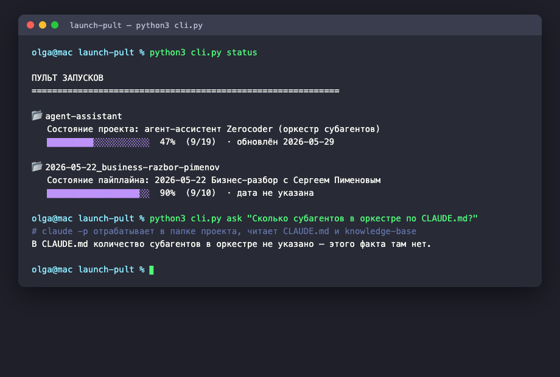
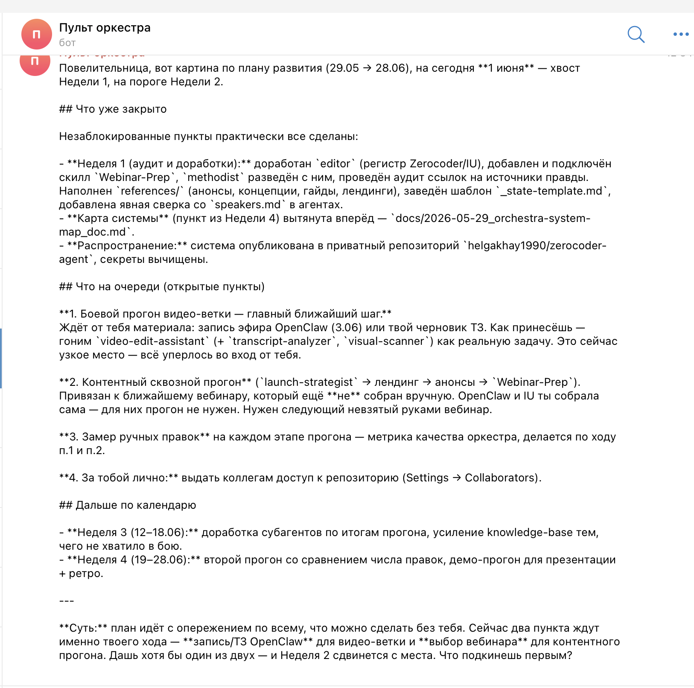

# 🎛 Пульт оркестра

Telegram-пульт и CLI для управления запусками Zerocoder поверх **оркестра субагентов**.
Сводит статус всех запусков из `_state.md` и пускает любой вопрос через оркестр
(`claude -p`) — с компьютера и с телефона.

> MVP в рамках курса по агентным системам. Полное описание — в [`docs/project-description.md`](docs/project-description.md).

## Зачем

Я веду параллельно несколько запусков — вебинары, акции, интенсивы. По каждому в
проекте лежит `_state.md` с этапами и открытыми вопросами. Две боли:

1. **Статус расползается по папкам** — нет единой картины, что на какой стадии.
2. **Оркестр из 14 субагентов живёт только в редакторе** — с телефона к нему не подойти.

Пульт закрывает обе: статус-борд одной командой + мост к оркестру в Telegram.

## Что умеет

| Функция | CLI | Telegram |
|---------|-----|----------|
| Статус-борд по всем `_state.md` (прогресс, дата, открытые вопросы, стадия) | `python3 cli.py status` | `/status` |
| Вопрос оркестру через `claude -p` | `python3 cli.py ask "..."` | любой текст |
| Замок доступа на один Telegram ID | — | ✅ |

## Как это выглядит

CLI — статус-борд и вопрос оркестру (реальный вывод):



Telegram-бот — вопрос оркестру прямо в чате (реальный ответ через `claude -p`):



## Архитектура

```
Telegram / терминал
        │
   ┌────┴─────┐
   │  bot.py  │  cli.py        ← интерфейсы (замок на user ID в боте)
   └────┬─────┘──────┐
        │            │
  ┌─────▼─────┐ ┌────▼──────────┐
  │ tracker.py│ │ orchestra.py  │
  │ читает    │ │ claude -p     │
  │ _state.md │ │ в папке проекта
  └───────────┘ └───────┬───────┘
                        │
              оркестр субагентов
              (.claude/agents, knowledge-base, skills)
```

Прослойка тонкая: трекер — чистый парсинг файлов на стандартной библиотеке, мост —
обёртка над `subprocess`. Вся «тяжёлая» логика остаётся в уже собранном оркестре.

## Запуск

### Трекер (без зависимостей)

```bash
python3 cli.py status
```

### Вопрос оркестру (нужен установленный Claude Code)

```bash
python3 cli.py ask "Что на очереди по плану?"
```

### Telegram-бот

```bash
python3 -m venv .venv && source .venv/bin/activate
pip install -r requirements.txt
cp .env.example .env       # заполнить токен и user ID
python3 src/bot.py
```

Для `.env` нужны:
- `TELEGRAM_BOT_TOKEN` — токен от [@BotFather](https://t.me/BotFather);
- `ALLOWED_USER_ID` — твой Telegram ID от [@userinfobot](https://t.me/userinfobot).

## Скилл

В репозитории лежит скилл проекта — [`skills/launch-pult/SKILL.md`](skills/launch-pult/SKILL.md).
Он учит агента, когда дёргать пульт (статус запусков / вопрос оркестру / запуск бота)
и по какому чек-листу.

## Структура

```
launch-pult/
├── cli.py                      # команды status / ask
├── src/
│   ├── tracker.py              # парсер _state.md → статус-борд
│   ├── orchestra.py            # мост к оркестру через claude -p
│   └── bot.py                  # Telegram-бот (замок на user ID)
├── skills/launch-pult/SKILL.md # скилл проекта
├── docs/project-description.md # полное описание проекта
├── screenshots/                # скриншоты работы
├── requirements.txt
└── .env.example
```

## Безопасность

- Токен и ID — только в `.env` (в `.gitignore`, в репозиторий не попадает).
- Бот отвечает строго владельцу; чужие сообщения отклоняются с записью в лог.
- Оркестр запускается в границах рабочей папки, наружу ничего не отправляется.

## Дальше

- Запуск конкретного субагента по команде (`/announce`, `/concept`).
- Напоминания по дедлайнам из `_state.md`.
- Перенос бота на VPS для работы 24/7.
